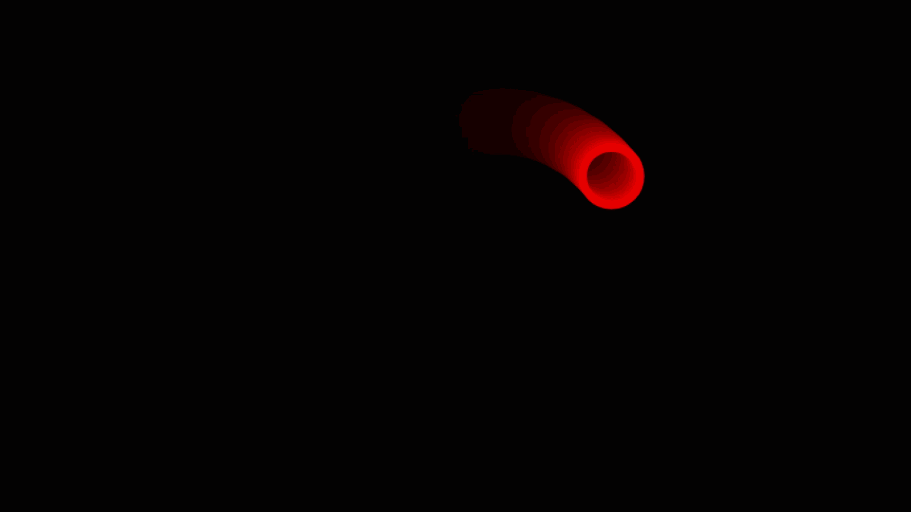

# base-demos
> Some simple demos using p5Js.

## Link
- [https://p5-demos.glitch.me/](https://p5-demos.glitch.me)
- [p5.js](https://p5js.org/zh-Hans/reference/#/p5/deltaTime)

## Examples

    
    
    

    
    
    

    
    
    

    
    <!--  -->
    

## Note

### lerp
* [https://en.wikipedia.org/wiki/Lerp](https://en.wikipedia.org/wiki/Lerp)

### deltaTime
* [https://en.wikipedia.org/wiki/Delta_time_(disambiguation)](https://en.wikipedia.org/wiki/Delta_time_(disambiguation))
* [https://www.youtube.com/watch?v=phX-1vq5YPw](https://www.youtube.com/watch?v=phX-1vq5YPw)